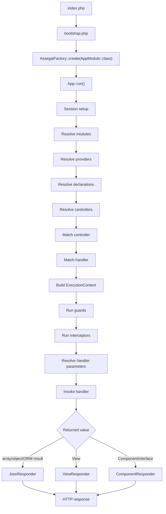
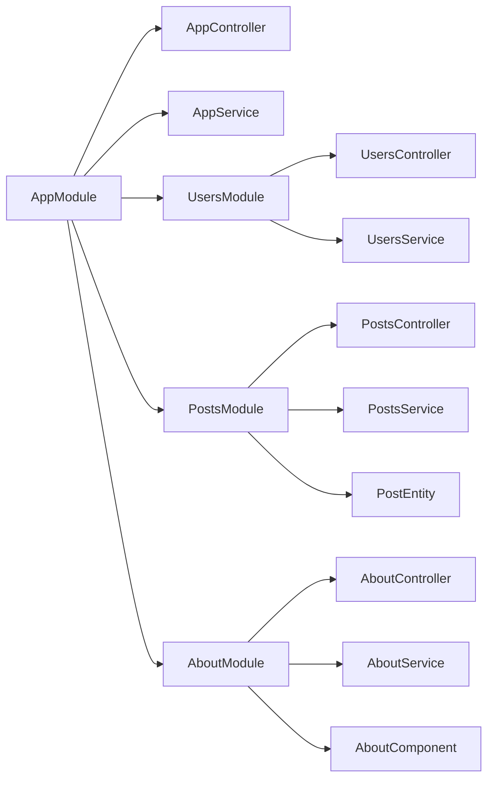

# Architecture and Lifecycle

Assegai is heavily inspired by NestJS, but expressed through modern PHP attributes, a CLI-first workflow, and an ecosystem that includes the core runtime, validation, forms, ORM, and queue integrations.

## The mental model

Think of an Assegai app as a composition of:

- modules for boundaries
- controllers for transport
- providers for behavior
- DTOs for input shape
- entities for persistence shape
- declarations and components for rendered UI
- responders for output format

That model gives you a consistent answer to a simple question:

> Where should this code live?

## The main building blocks

### Modules

Modules are the unit of composition. They tell Assegai what belongs together:

- controllers
- providers
- declarations
- imported modules
- exported providers

### Controllers

Controllers define routes and translate HTTP requests into application calls.

### Providers

Providers are injectable classes. In practice, these are your services, coordinators, or infrastructure wrappers.

### Declarations and components

Pages generated through `assegai g pg ...` use a declaration-based rendering flow:

- a module declares the component
- a controller returns a `ComponentInterface`
- the component responder renders HTML

### Views

The starter app also shows a classic template-based path through `View` objects and `view('template', $data)`.

### Responders

Assegai decides how to serialize the handler result based on the returned type:

- arrays and objects go through JSON responders
- `View` goes through the view responder
- components go through the component responder
- ORM query results are recognized and wrapped into API-style JSON responses

## Application lifecycle

At a high level, the runtime looks like this:

This flow is also visible in the event channels exposed by core:

- app init
- module resolution
- provider resolution
- declaration resolution
- controller resolution
- request handling
- guard resolution
- interceptor resolution
- response start and finish

## Development ergonomics matter too

Architecture is not only about how features are composed. It is also about how quickly you can understand failure.

In non-production mode, Assegai initializes Whoops-backed error and exception handlers:

- `GET` requests render an HTML error page
- CLI failures render plain text
- non-`GET` HTTP errors render JSON-oriented output

That split is small, but it has a nice effect:

- page work gets a browser-friendly debugging surface
- API work still gets machine-readable error responses
- local iteration stays fast without replacing the framework defaults

## Why this structure is useful

A lot of PHP applications become hard to change because transport, business logic, rendering, and persistence all end up blended together. Assegai tries to keep those seams visible:

- controllers should say what happens
- providers should say how it happens
- modules should say where it belongs
- responders should say how it leaves the system

That is especially helpful once a project has:

- multiple route areas
- admin and public surfaces
- rendered pages and JSON APIs living side by side
- database-backed features

## A small architecture map

This is the shape the CLI encourages because it scales without forcing a lot of upfront ceremony.

## Response shapes are a feature

One underrated design decision in Assegai is that the return type itself can stay expressive:

- return a plain array for simple JSON
- return an ORM `FindResult` when your data layer already gives you one
- return a `View` for classic template rendering
- return `render(SomeComponent::class)` for component-backed HTML

That keeps the controller code terse while still letting the framework pick the right responder.

## What to learn next

If you want to get productive fast:

- learn [Controllers and Routing](./controllers-and-routing.md)
- understand [Modules and Providers](./modules-and-providers.md)
- learn [Guards, Interceptors, Pipes, and Middleware](./guards-interceptors-pipes-and-middleware.md) for cross-cutting behavior
- use [Pages and Components](./pages-and-components.md) for server-rendered UI
- use [Data and ORM](./data-and-orm.md) once your feature needs persistence
- use [Queues and Background Jobs](./queues-and-background-jobs.md) when work should happen outside the request cycle
