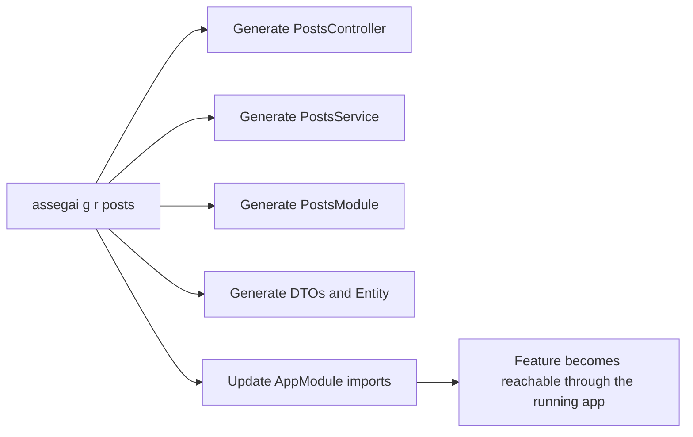
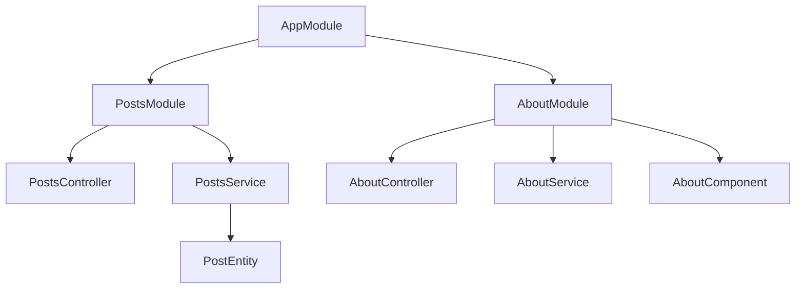

# Building a Feature

You do not need to understand every Assegai term before you start. The pieces below show up in the order a normal app usually needs them.

It walks through the kind of workflow that makes Assegai feel fast in practice:

1. scaffold a new app
2. generate a resource
3. turn the generated placeholders into a real ORM-backed feature
4. add validation at the edge
5. generate a page
6. grow the app by composing modules

This walkthrough does more than produce a `posts` endpoint. It shows why the framework's design choices help once the app becomes more than a demo.

## Start from a new app

Create and enter a new project:

```bash
assegai new publishing-suite
cd publishing-suite
assegai serve
```

At this point you already have:

- a root `index.php` request entry point
- a `bootstrap.php` that creates the app through `AssegaiFactory`
- a root module
- a starter controller and service
- a rendered home page

That is a productive starting state, not just an empty shell.

## Generate a resource in one command

Now generate a posts feature:

```bash
assegai g r posts
```

When you run that from the project root, the CLI creates the feature and updates `AppModule` for you.



You now have a route surface immediately:

- `GET /posts`
- `GET /posts/:id`
- `POST /posts`
- `PUT /posts/:id`
- `DELETE /posts/:id`

The generated service methods still return placeholder strings, but the feature is already wired into the app and reachable through HTTP. That is the "move fast, refine deliberately" workflow Assegai is aiming for.

## Understand the generated shape

The generated controller is intentionally thin:

```php
<?php

namespace Assegaiphp\PublishingSuite\Posts;

use Assegai\Core\Attributes\Controller;
use Assegai\Core\Attributes\Http\Body;
use Assegai\Core\Attributes\Http\Delete;
use Assegai\Core\Attributes\Http\Get;
use Assegai\Core\Attributes\Http\Post;
use Assegai\Core\Attributes\Http\Put;
use Assegai\Core\Attributes\Param;
use Assegaiphp\PublishingSuite\Posts\DTOs\CreatePostDTO;
use Assegaiphp\PublishingSuite\Posts\DTOs\UpdatePostDTO;

#[Controller('posts')]
readonly class PostsController
{
  public function __construct(private PostsService $postsService)
  {
  }

  #[Get]
  public function findAll(): string
  {
    return $this->postsService->findAll();
  }

  #[Get(':id')]
  public function findById(#[Param('id')] int $id): string
  {
    return $this->postsService->findById($id);
  }

  #[Post]
  public function create(#[Body] CreatePostDTO $dto): string
  {
    return $this->postsService->create($dto);
  }
}
```

That shape tells you what belongs where:

- routing belongs to the controller
- business behavior belongs to the provider
- request shape belongs to DTOs
- persistence shape belongs to entities

## Upgrade the DTOs from placeholders to contracts

The generated DTOs start empty on purpose. Fill them in with the request shape you actually want:

```php
<?php

namespace Assegaiphp\PublishingSuite\Posts\DTOs;

use Assegai\Core\Attributes\Injectable;
use Assegai\Validation\Attributes\IsNotEmpty;
use Assegai\Validation\Attributes\IsString;

#[Injectable]
class CreatePostDTO
{
  #[IsString]
  #[IsNotEmpty]
  public string $title = '';

  #[IsString]
  #[IsNotEmpty]
  public string $body = '';
}
```

The app API also exposes a global pipe registration path in `bootstrap.php`:

```php
<?php

use Assegai\Core\AssegaiFactory;
use Assegai\Core\Pipes\ValidationPipe;
use Assegaiphp\PublishingSuite\AppModule;

require __DIR__ . '/vendor/autoload.php';

function bootstrap(): void
{
  $app = AssegaiFactory::createFromProject(AppModule::class, __DIR__);
  $app->useGlobalPipes(new ValidationPipe());
  $app->run();
}

bootstrap();
```

If your app version uses that global pipe path, it keeps request validation near the transport boundary instead of repeating checks deep in services.

The clearest request-time pipe flow I verified directly in the current core is decorator-bound handling on request parameters like `#[Body(pipes: ...)]`, so that is still a good mental model to keep in mind.

## Turn the entity into a real model

The generated entity gives you an id. The next step is to describe real columns and point the entity at a configured data source:

```php
<?php

namespace Assegaiphp\PublishingSuite\Posts\Entities;

use Assegai\Orm\Attributes\Columns\Column;
use Assegai\Orm\Attributes\Columns\PrimaryGeneratedColumn;
use Assegai\Orm\Attributes\Entity;
use Assegai\Orm\Queries\Sql\ColumnType;
use Assegai\Orm\Traits\ChangeRecorderTrait;

#[Entity(
  table: 'posts',
  database: 'blog',
)]
class PostEntity
{
  use ChangeRecorderTrait;

  #[PrimaryGeneratedColumn]
  public ?int $id = null;

  #[Column(type: ColumnType::VARCHAR, nullable: false)]
  public string $title = '';

  #[Column(type: ColumnType::TEXT)]
  public string $body = '';
}
```

The `database` name should match the connection configured in `config/default.php`.

If you want the whole feature to share the same default connection, you can also put it on the module:

```php
<?php

namespace Assegaiphp\PublishingSuite\Posts;

use Assegai\Core\Attributes\Modules\Module;

#[Module(
  providers: [PostsService::class],
  controllers: [PostsController::class],
  config: ['data_source' => 'mysql:blog'],
)]
class PostsModule
{
}
```

That gives you a good spectrum of choices:

- app-wide default on `AppModule`
- feature default on `PostsModule`, ideally with the fully qualified `driver:name` format
- explicit override on `PostEntity`

## Replace placeholders with a repository-backed service

Once the entity is ready, the service becomes real application code:

```php
<?php

namespace Assegaiphp\PublishingSuite\Posts;

use Assegai\Core\Attributes\Injectable;
use Assegai\Orm\Attributes\InjectRepository;
use Assegai\Orm\Management\Repository;
use Assegaiphp\PublishingSuite\Posts\DTOs\CreatePostDTO;
use Assegaiphp\PublishingSuite\Posts\Entities\PostEntity;
use RuntimeException;

#[Injectable]
class PostsService
{
  public function __construct(
    #[InjectRepository(PostEntity::class)]
    private Repository $postsRepository,
  ) {
  }

  public function findAll(): array
  {
    return $this->postsRepository->find([
      'order' => ['id' => 'DESC'],
      'limit' => 20,
      'skip' => 0,
    ])->getData();
  }

  public function findById(int $id): object
  {
    return $this->postsRepository->findOne([
      'where' => ['id' => $id],
    ])->getFirst();
  }

  public function create(CreatePostDTO $dto): object
  {
    $post = $this->postsRepository->create($dto);

    $saveResult = $this->postsRepository->save($post);

    if ($saveResult->isError()) {
      throw new RuntimeException('Failed to create post.', previous: $saveResult->getErrors()[0]);
    }

    return $post;
  }
}
```

Two design benefits show up here:

- dependency injection keeps the service easy to test
- the controller does not need to know anything about persistence details

Two practical defaults matter too:

- DTOs are already plain PHP objects, so `create($dto)` and `update(..., $dto)` are usually the cleanest starting point
- `save()` is usually a better default than `insert()` because it stays comfortable once relations and richer entity state enter the picture

## Let the controller stay simple

After that change, the controller can return plain objects and arrays without owning the repository details:

```php
<?php

namespace Assegaiphp\PublishingSuite\Posts;

use Assegai\Core\Attributes\Controller;
use Assegai\Core\Attributes\Http\Body;
use Assegai\Core\Attributes\Http\Get;
use Assegai\Core\Attributes\Http\Post;
use Assegai\Core\Attributes\Param;
use Assegaiphp\PublishingSuite\Posts\DTOs\CreatePostDTO;

#[Controller('posts')]
readonly class PostsController
{
  public function __construct(private PostsService $postsService)
  {
  }

  #[Get]
  public function findAll(): array
  {
    return $this->postsService->findAll();
  }

  #[Get(':id<int>')]
  public function findById(#[Param('id')] int $id): object
  {
    return $this->postsService->findById($id);
  }

  #[Post]
  public function create(#[Body] CreatePostDTO $dto): object
  {
    return $this->postsService->create($dto);
  }
}
```

That is a good example of how Assegai helps you keep controllers declarative instead of procedural.

## Add a page without leaving the same architecture

API work is only one side of the framework. If you also want an `about` page, generate it:

```bash
assegai g pg about
```

That creates a dedicated module with:

- `AboutController`
- `AboutService`
- `AboutComponent`
- a Twig template
- a CSS file

The page becomes part of the same modular graph as the API:



This is one of Assegai's strongest ideas: JSON endpoints and rendered pages do not need different architectural systems.

## Grow into nested modules when the app gets larger

Once a project starts to split into public and internal areas, nested modules help keep route structure readable.

```php
<?php

namespace Assegaiphp\PublishingSuite\Admin;

use Assegai\Core\Attributes\Controller;
use Assegai\Core\Attributes\Http\Get;
use Assegai\Core\Attributes\Modules\Module;

#[Controller('admin')]
class AdminController
{
  #[Get]
  public function index(): array
  {
    return ['area' => 'admin'];
  }
}

#[Controller('audit')]
class AuditController
{
  #[Get]
  public function index(): array
  {
    return ['area' => 'audit'];
  }
}

#[Module(
  controllers: [AuditController::class],
)]
class AuditModule
{
}

#[Module(
  controllers: [AdminController::class],
  imports: [AuditModule::class],
)]
class AdminModule
{
}
```

Imported into `AppModule`, that gives you a route branch like:

- `GET /admin`
- `GET /admin/audit`

That is a good moment to appreciate why Assegai is so module-driven: route structure and code ownership evolve together.

## The practical takeaway

Assegai is at its best when you let the CLI create the shape quickly and then refine the generated code feature by feature.

A productive default workflow is:

1. scaffold the app with `assegai new`
2. generate features with `assegai g r ...` and `assegai g pg ...`
3. keep controllers thin
4. put use-case logic in providers
5. model input with DTOs
6. add validation at the request boundary
7. add ORM repositories when the feature needs persistence
8. compose growth through modules instead of ad-hoc wiring

That combination is what makes Assegai useful beyond small demos: it is quick at the start, but it also gives you a clean path into larger applications.
