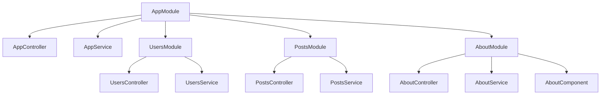

# Modules and Providers

Modules are the structural backbone of an Assegai application. Providers are the units of behavior those modules expose.

In plain terms, a module answers "what belongs together?" and a provider answers "which class contains the application work?"

If controllers are the framework-facing edge of your app, providers are the application-facing core.

## A real root module

A scaffolded app starts with a root module like this:

```php
<?php

namespace Assegaiphp\BlogApi;

use Assegai\Core\Attributes\Modules\Module;
use Assegaiphp\BlogApi\Users\UsersModule;
use Assegaiphp\BlogApi\About\AboutModule;
use Assegaiphp\BlogApi\Posts\PostsModule;

#[Module(
  providers: [AppService::class],
  controllers: [AppController::class],
  imports: [UsersModule::class, AboutModule::class, PostsModule::class],
)]
class AppModule
{
}
```

Framework-provided services like `ProjectConfig`, `Request`, and `Response` do not need to be added here manually.

This is already a strong statement about how Assegai wants you to build:

- root composition happens in one place
- features live in their own modules
- application services are injected, not manually new'd up

## A feature module

A generated resource module stays simple:

```php
<?php

namespace Assegaiphp\BlogApi\Posts;

use Assegai\Core\Attributes\Modules\Module;

#[Module(
  providers: [PostsService::class],
  controllers: [PostsController::class],
)]
class PostsModule
{
}
```

That simplicity is intentional. Modules should mostly describe relationships.

## Providers are where application logic lives

Providers should be marked `#[Injectable]`:

```php
<?php

namespace Assegaiphp\BlogApi\Posts;

use Assegai\Core\Attributes\Injectable;
use Assegaiphp\BlogApi\Posts\DTOs\CreatePostDTO;
use Assegaiphp\BlogApi\Posts\DTOs\UpdatePostDTO;

#[Injectable]
class PostsService
{
  public function findAll(): string
  {
    return 'This action returns all posts!';
  }

  public function findById(int $id): string
  {
    return "This action returns the #$id post!";
  }

  public function create(CreatePostDTO $dto): string
  {
    return 'This action creates a new post!';
  }

  public function updateById(int $id, UpdatePostDTO $dto): string
  {
    return "This action updates the #$id post!";
  }
}
```

The generated strings are only placeholders, but the shape is right: controllers translate transport into provider calls, and providers own the actual use case.

## Constructor injection is the default

Controllers consume providers through constructor injection:

```php
<?php

namespace Assegaiphp\BlogApi\Posts;

use Assegai\Core\Attributes\Controller;
use Assegai\Core\Attributes\Http\Get;

#[Controller('posts')]
readonly class PostsController
{
  public function __construct(private PostsService $postsService)
  {
  }

  #[Get]
  public function findAll(): string
  {
    return $this->postsService->findAll();
  }
}
```

That same pattern also works between providers. As your app grows, you can inject:

- other application services
- `ProjectConfig`
- repositories
- custom guards
- interceptors

## Module composition diagram



That composition model is one of the main reasons Assegai stays understandable past the hello-world stage.

## Declarations belong in modules too

Page generation introduces a third category beyond controllers and providers: declarations.

```php
#[Module(
  declarations: [AboutComponent::class],
  providers: [AboutService::class],
  controllers: [AboutController::class],
)]
readonly class AboutModule
{
}
```

This is important because it makes the rendered UI part of the same modular graph as the API surface.

## Nested modules build route branches

Nested modules are not just an organizational trick. They help shape larger route trees.

For example:

```php
<?php

namespace Assegaiphp\BlogApi\Admin;

use Assegai\Core\Attributes\Controller;
use Assegai\Core\Attributes\Http\Get;
use Assegai\Core\Attributes\Modules\Module;

#[Controller('admin')]
class AdminController
{
  #[Get]
  public function index(): array
  {
    return ['area' => 'admin'];
  }
}

#[Controller('audit')]
class AuditController
{
  #[Get]
  public function index(): array
  {
    return ['area' => 'audit'];
  }
}

#[Module(
  controllers: [AuditController::class],
)]
class AuditModule
{
}

#[Module(
  controllers: [AdminController::class],
  imports: [AuditModule::class],
)]
class AdminModule
{
}
```

Imported this way, the branch stays readable:

- `GET /admin`
- `GET /admin/audit`

That is the kind of modular nesting that becomes valuable once an app grows past a handful of top-level features.

## The CLI can generate nested feature modules

You do not have to hand-build nested feature trees yourself.

If you want an API area and then feature-specific routes inside it, you can scaffold it directly:

```bash
assegai g r api
assegai g r api/posts
```

That produces a nested module layout like:

```text
src/Api/
├── ApiController.php
├── ApiModule.php
├── ApiService.php
├── DTOs/
├── Entities/
└── Posts/
    ├── PostsController.php
    ├── PostsModule.php
    ├── PostsService.php
    ├── DTOs/
    └── Entities/
```

And the imports are wired automatically:

```php
<?php

namespace Assegaiphp\BlogApi\Api;

use Assegai\Core\Attributes\Modules\Module;
use Assegaiphp\BlogApi\Api\Posts\PostsModule;

#[Module(
  providers: [ApiService::class],
  controllers: [ApiController::class],
  imports: [PostsModule::class],
)]
class ApiModule
{
}
```

That is one of the nicer parts of the Assegai CLI story: nested route branches and nested module trees can be generated from the path you give the schematic.

## How generators help

When you run generators from the project root, the CLI updates `AppModule` for you by adding:

- the correct `use` statement
- the new module class in `imports`

That is more than convenience. It reduces the chance that generated features are created but never composed into the running app.

## Design benefits

Modules and providers pay off quickly:

- feature boundaries stay visible
- constructor signatures document dependencies
- tests can target providers without going through HTTP
- rendered pages and JSON APIs can share the same service layer
- scaling the app usually means adding modules, not reorganizing the whole tree

## Rule of thumb

When you are deciding where code should go:

- module: ownership and composition
- controller: transport and routing
- provider: behavior and orchestration
- declaration/component: rendered UI
- entity: persistence shape
