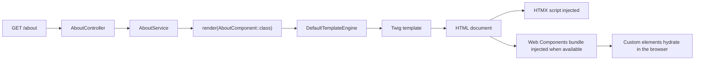

# Pages and Components

Assegai is not limited to JSON APIs. The rendering stack already supports a practical server-first UI model built from four pieces that work well together:

- classic `View` rendering for straightforward templates
- component-backed pages built from module declarations and `AssegaiComponent`
- HTMX, which is injected automatically into rendered HTML pages
- Web Components, which can be rendered on the server and hydrated in the browser

The important idea is that Assegai treats HTML as a first-class response type. You can start with server-rendered pages, add HTMX where interaction helps, and introduce Web Components when a custom element earns its keep.

## Choose the simplest rendering shape that fits

Use a classic `View` when:

- the page is mostly a template and some data
- you want the shortest path from controller or service to HTML
- the page already belongs under `src/Views`

Use a component-backed page when:

- the page belongs to a feature module
- template, styles, controller, and service should live together
- you want declarations to participate in the module graph

Add HTMX when:

- you want progressive enhancement without committing to a SPA
- user actions should fetch or swap HTML over HTTP
- the page already works server-side and just needs more interactivity

Add Web Components when:

- a piece of UI benefits from browser lifecycle hooks
- you want reusable custom elements across pages or features
- the server should still own the initial HTML shape and data

## Classic views are the fastest path to HTML

The scaffolded starter app uses a `View`:

```php
<?php

namespace Assegaiphp\BlogApi;

use Assegai\Core\Attributes\Injectable;
use Assegai\Core\Config;
use Assegai\Core\Config\ProjectConfig;
use Assegai\Core\Rendering\View;

#[Injectable]
class AppService
{
  public function __construct(protected ProjectConfig $config)
  {
  }

  public function home(): View
  {
    $name = $this->config->get('name') ?? 'Your app';

    return view('index', [
      'title' => 'Muli Bwanji',
      'subtitle' => "Congratulations! $name is running.",
      'welcomeLink' => Config::get('contact')['links']['assegai_website'],
      'documentationLink' => Config::get('contact')['links']['documentation_link'],
    ]);
  }
}
```

That helper resolves templates from:

```text
src/Views/
```

This is the right fit when you want plain server-rendered HTML without introducing a dedicated feature module.

## Component-backed pages give UI a feature boundary

When you generate a page:

```bash
assegai g pg about
```

the CLI creates a feature folder like this:

```text
src/About/
├── AboutComponent.css
├── AboutComponent.php
├── AboutComponent.twig
├── AboutController.php
├── AboutModule.php
└── AboutService.php
```

That page is rendered through the same module system that organizes controllers and providers.

### The module declares the page component

```php
<?php

namespace Assegaiphp\BlogApi\About;

use Assegai\Core\Attributes\Modules\Module;

#[Module(
  declarations: [AboutComponent::class],
  providers: [AboutService::class],
  controllers: [AboutController::class],
)]
readonly class AboutModule
{
}
```

`declarations` is the key piece. It tells Assegai which UI components belong to the module's rendering graph.

### The service returns a rendered component

```php
<?php

namespace Assegaiphp\BlogApi\About;

use Assegai\Core\Attributes\Injectable;
use Assegai\Core\Components\Interfaces\ComponentInterface;

#[Injectable]
class AboutService
{
  public function getAboutPage(): ComponentInterface
  {
    return render(AboutComponent::class);
  }
}
```

The `render()` helper resolves the component through the container and hands it to the HTML responder.

### The generated component is server-rendered

With the current generator defaults, the component selector is prefixed:

```php
<?php

namespace Assegaiphp\BlogApi\About;

use Assegai\Core\Attributes\Component;
use Assegai\Core\Components\AssegaiComponent;

#[Component(
  selector: 'app-about',
  templateUrl: './AboutComponent.twig',
  styleUrls: ['./AboutComponent.css'],
)]
class AboutComponent extends AssegaiComponent
{
  public string $name = 'about';
}
```

And the template stays simple:

```twig
<p>{{ name }} works!</p>
```

## HTMX is available on rendered pages out of the box

Both of Assegai's HTML rendering paths inject HTMX automatically. That means server-rendered pages can start using `hx-*` attributes immediately without any extra setup step in your layout.

For example, a component template can progressively enhance a normal page section:

```twig
<section>
  <button
    hx-get="/about/team"
    hx-target="#team-panel"
    hx-swap="innerHTML"
  >
    Load team details
  </button>

  <div id="team-panel">
    <p>Team details will load here.</p>
  </div>
</section>
```

Assegai does not force an SPA-style rendering model here. The page is still server-rendered first, and HTMX becomes an opt-in enhancement on top.

## Web Components now fit naturally into the rendering story

Server-rendered HTML and custom elements are a good match. Assegai's Web Components support is built around that idea:

- render a custom element tag from Twig or a PHP view
- pass props from PHP into a safe `data-props` attribute
- let the browser hydrate that element once the module bundle loads

### Twig templates get a safe props helper

Inside Twig component templates, use `ctx.webComponentProps(...)`:

```twig
<app-user-card data-props='{{ ctx.webComponentProps({
  name: name,
  quote: quote
}) }}'>
  <p>{{ name }}</p>
</app-user-card>
```

This helper returns JSON escaped for use inside an HTML attribute, so quotes and markup in the payload do not break the page.

### PHP views can use the same pattern

In a classic PHP view, use the global helper directly:

```php
<app-user-card
  data-props='<?= web_component_props([
    "name" => $name,
    "quote" => $quote,
  ]) ?>'
></app-user-card>
```

### The bundle is injected automatically when available

Assegai looks for a Web Components bundle and injects a module script tag into rendered HTML when it resolves one.

The default browser URL is:

```text
/js/assegai-components.min.js
```

So if this file exists:

```text
public/js/assegai-components.min.js
```

it will be included automatically.

You can also configure the bundle explicitly in `assegai.json`:

```json
{
  "webComponents": {
    "enabled": true,
    "output": "public/js/assegai-components.min.js"
  }
}
```

The runtime currently recognizes these keys:

- `enabled`
- `bundleUrl`
- `bundlePath`
- `output`

Use `enabled: false` to disable automatic injection entirely.

### Helpful runtime helpers are available

Assegai exposes small helpers around the bundle and prop encoding:

```php
web_component_props($props);
web_component_bundle_url();
web_component_bundle_tag();
```

Inside Twig component templates, these are surfaced through `ctx`:

```twig
{{ ctx.webComponentProps({ name: name }) }}
{{ ctx.webComponentBundleUrl() }}
```

In most apps you will not need to call `web_component_bundle_tag()` manually because the default HTML renderers already append it for you.

## HTMX and Web Components complement each other well

These tools are solving different parts of the same problem:

- HTMX is great at asking the server for more HTML
- Web Components are great at owning client-side behavior for a specific custom element

That makes this a natural combination:

1. the server renders an initial page
2. HTMX swaps in more HTML later
3. that HTML can include custom elements such as `<app-user-card>`
4. once the module bundle is loaded, the browser upgrades those elements

You do not need to choose one or the other for the whole application.

## The CLI workflow now supports paired Web Components

With the current `assegaiphp/console` support, you can keep the server-rendered feature structure and add browser-side elements where useful.

Generate a standalone Web Component:

```bash
assegai g wc ui/alert
```

Pair a generated component or page with a `.wc.ts` runtime file:

```bash
assegai g component user-card --wc
assegai g pg about --wc
```

Build or inspect the discovered components:

```bash
assegai wc:build
assegai wc:watch
assegai wc:list
```

The default build target is:

```text
public/js/assegai-components.min.js
```

which lines up with the automatic bundle detection in `assegaiphp/core`.

The CLI side of the workflow is driven by `assegai.json`:

```json
{
  "webComponents": {
    "prefix": "app",
    "output": "public/js/assegai-components.min.js",
    "buildOnDumpAutoload": false
  }
}
```

Use `prefix` to control generated selectors such as `app-about` and `app-user-card`. Use `output` to control where the bundle is written. If you want the bundle rebuilt as part of `assegai dump-autoload`, set `buildOnDumpAutoload` to `true`.

## How the full rendering flow fits together



## A good default way to think about it

Start with server-rendered HTML.

Reach for a classic `View` when the page is simple. Reach for a component-backed page when the feature deserves its own boundary. Add HTMX when interactions should request HTML over HTTP. Add Web Components when a specific element needs browser-side lifecycle and behavior.

That keeps Assegai in its strongest shape: server-first, modular, progressively enhanced, and still comfortable to grow.
