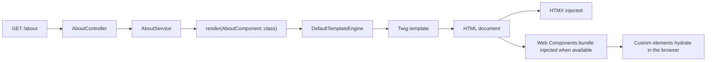

# Pages and Components

This page covers the HTML side of Assegai.

You do not need a SPA or a lot of browser code to build useful pages. The same app can render HTML on the server, add HTMX where it helps, and hydrate custom elements only when a piece of UI needs browser-side behavior.

That gives you three practical UI shapes:

- classic `View` rendering for straightforward server-rendered pages
- component-backed pages when a feature deserves its own template, service, and module boundary
- browser-side Web Components when a specific piece of UI needs lifecycle hooks or reusable client-side behavior

If you are trying to decide where front-end code should live in a real project, read [Frontend with Web Components](./frontend-with-web-components.md) alongside this guide. That guide covers the supported runtime flow for new apps and includes a short FAQ for older projects that still define everything in `public/js/main.js`.

## Choose the simplest rendering shape that fits

Use a classic `View` when:

- the page is mostly template plus data
- you want the shortest path from controller to HTML
- the page already belongs under `src/Views`

Use a component-backed page when:

- the page belongs to a feature module
- template, styles, controller, and service should live together
- you want page UI to participate in the same module graph as the rest of the feature

Add HTMX when:

- you want progressive enhancement without moving to a SPA
- user actions should request or swap HTML over HTTP
- the page already works server-side and just needs richer interaction

Add Web Components when:

- a specific element benefits from browser lifecycle hooks
- you want reusable custom elements across pages or features
- the server should still own the initial HTML and data shape

## Classic views are the fastest path to HTML

The starter app uses a `View`:

```php
<?php

namespace Assegaiphp\BlogApi;

use Assegai\Core\Attributes\Injectable;
use Assegai\Core\Config;
use Assegai\Core\Config\ProjectConfig;
use Assegai\Core\Rendering\View;

#[Injectable]
class AppService
{
  public function __construct(protected ProjectConfig $config)
  {
  }

  public function home(): View
  {
    $name = $this->config->get('name') ?? 'Your app';

    return view('index', [
      'title' => 'Muli Bwanji',
      'subtitle' => "Congratulations! $name is running.",
      'welcomeLink' => Config::get('contact')['links']['assegai_website'],
      'guideLink' => Config::get('contact')['links']['guide_link'],
    ]);
  }
}
```

That helper resolves templates from:

```text
src/Views/
```

This is the right fit when you want plain server-rendered HTML without introducing a feature-specific page component.

## Component-backed pages give UI a feature boundary

When you generate a page:

```bash
assegai g pg about
```

the CLI creates a feature folder like this:

```text
src/About/
├── AboutComponent.css
├── AboutComponent.php
├── AboutComponent.twig
├── AboutController.php
├── AboutModule.php
└── AboutService.php
```

That page is rendered through the same module system that organizes controllers and providers.

### The module declares the page component

```php
<?php

namespace Assegaiphp\BlogApi\About;

use Assegai\Core\Attributes\Modules\Module;

#[Module(
  declarations: [AboutComponent::class],
  providers: [AboutService::class],
  controllers: [AboutController::class],
)]
readonly class AboutModule
{
}
```

`declarations` is the important piece. It tells Assegai which UI components belong to the module's rendering graph.

### The service returns a rendered component

```php
<?php

namespace Assegaiphp\BlogApi\About;

use Assegai\Core\Attributes\Injectable;
use Assegai\Core\Components\Interfaces\ComponentInterface;

#[Injectable]
class AboutService
{
  public function getAboutPage(): ComponentInterface
  {
    return render(AboutComponent::class);
  }
}
```

### The generated component is server-rendered

```php
<?php

namespace Assegaiphp\BlogApi\About;

use Assegai\Core\Attributes\Component;
use Assegai\Core\Components\AssegaiComponent;

#[Component(
  selector: 'app-about',
  templateUrl: './AboutComponent.twig',
  styleUrls: ['./AboutComponent.css'],
)]
class AboutComponent extends AssegaiComponent
{
  public string $name = 'about';
}
```

And the template can stay small:

```twig
<p>{{ name }} works!</p>
```


## Twig in Assegai uses normal Twig syntax

If you have never used Twig before, the main thing to know is that Assegai is not inventing a new template language here. A `.twig` file is a normal Twig template rendered on the server.

The most common pieces are:

- `{{ ... }}` to print a value
- `` and `` for conditions
- `` for loops
- `{# ... #}` for comments
- ``, ``, and `` for larger template layouts

For example:

```twig
<section class="about-page">
  <h1>{{ title }}</h1>

  
    <p>{{ subtitle }}</p>
  

  <ul>
    
      <li>{{ member.name }}</li>
    
  </ul>
</section>
```

So if someone on your team already knows Twig from another PHP project, that knowledge mostly transfers directly.

## What data a Twig template receives in Assegai

In a component-backed page, Assegai gives the template:

- the component's public properties as normal Twig variables like `{{ title }}`
- the `ctx` helper object for calling component methods and framework helpers

That means a component like this:

```php
<?php

#[Component(
  selector: 'app-about',
  templateUrl: './AboutComponent.twig',
)]
class AboutComponent extends AssegaiComponent
{
  public string $title = 'About us';
  public ?string $subtitle = 'Built with Assegai';

  public function greeting(): string
  {
    return 'Welcome to the team page.';
  }
}
```

can be rendered like this:

```twig
<section>
  <h1>{{ title }}</h1>
  <p>{{ subtitle }}</p>
  <p>{{ ctx.greeting() }}</p>
</section>
```

The important distinction is:

- use plain Twig variables for public component properties
- use `ctx.methodName()` for public component methods

## Helpers that Assegai adds to Twig

Assegai keeps the Twig environment fairly small on purpose. The built-in helpers you should expect are:

- `ctx.config(path, default = null)` for config values
- `ctx.translate(id, parameters = [], domain = '', locale = null)` for translations
- `ctx.timeAgo(timestamp, timezone = null)` for relative time output
- `ctx.env(key, default = null)` for environment values
- `ctx.getLang()` for the current language
- `ctx.webComponentProps(...)` or `ctx.wcProps(...)` for safe Web Component props
- `ctx.webComponentBundleUrl()` for the bundle URL

Example:

```twig
<article>
  <h1>{{ title }}</h1>
  <p>{{ ctx.timeAgo(publishedAt) }}</p>
  <p>{{ ctx.translate('posts.read_more') }}</p>
</article>
```

## Do not assume every Twig ecosystem feature is already enabled

This is where confusion usually starts for people coming from Symfony or another Twig-heavy stack.

Assegai does not automatically give you every helper or extension you may have seen elsewhere. For example, you should not assume things like these exist unless you add them yourself:

- a global `app` object
- `path()` or `url()` routing helpers
- `asset()` helpers
- `form_*()` helpers
- `csrf_token()`
- random third-party Twig extensions

In other words, standard Twig language features work, but framework-specific extras are only available if Assegai explicitly adds them.

## Where to learn more Twig itself

Use the Assegai guides for the Assegai-specific part of the workflow:

- this guide for how pages and components fit together
- [Frontend with Web Components](./frontend-with-web-components.md) for where browser code should live

Use the official Twig docs for the template language itself:

- [Twig template basics](https://twig.symfony.com/doc/3.x/templates.html)
- [Twig tags reference](https://twig.symfony.com/doc/3.x/tags/index.html)
- [Twig filters reference](https://twig.symfony.com/doc/3.x/filters/index.html)
- [Twig functions reference](https://twig.symfony.com/doc/3.x/functions/index.html)

## HTMX is available on rendered pages out of the box

Both HTML rendering paths inject HTMX automatically. That means server-rendered pages can start using `hx-*` attributes without a separate layout step.

```twig
<section>
  <button
    hx-get="/about/team"
    hx-target="#team-panel"
    hx-swap="innerHTML"
  >
    Load team details
  </button>

  <div id="team-panel">
    <p>Team details will load here.</p>
  </div>
</section>
```

You do not need to choose between HTMX and Web Components for the whole app. A page can use both.

## Web Components fit naturally into the rendering story

Assegai's Web Components support is built around a server-first model:

- render a custom element tag from Twig or a PHP view
- pass props from PHP into a safe `data-props` attribute
- let the browser hydrate that element once the module bundle loads

### Twig templates get a safe props helper

```twig
<app-user-card data-props='{{ ctx.webComponentProps({
  name: name,
  quote: quote
}) }}'>
  <p>{{ name }}</p>
</app-user-card>
```

That helper is doing one practical job: turning your PHP or Twig data into JSON that is safe to place inside an HTML attribute.

Without that step, quotes and special characters can break the markup. So although the browser ultimately receives a JSON string, `ctx.webComponentProps(...)` keeps the template code safe and predictable.

### PHP views can use the same pattern

```php
<app-user-card
  data-props='<?= web_component_props([
    "name" => $name,
    "quote" => $quote,
  ]) ?>'
></app-user-card>
```

The PHP helper exists for the same reason. It keeps the Twig and PHP view story consistent.

## Keep `main.js` and first-party Web Components in the right places

This is the part that tends to cause confusion in upgraded projects.

Use `public/js/main.js` for:

- small global page scripts
- third-party browser libraries that are not part of the Assegai Web Components workflow
- one-off DOM hooks that do not need to become reusable custom elements

Use generated `.wc.ts` files for:

- new custom elements created through `assegai g wc ...`
- paired page or component runtime files created with `--wc`
- client-side UI that should be discovered by `wc:list`, bundled by `wc:build`, and watched by `wc:watch`

You can keep an existing `main.js` in an older project. The important part is not to keep adding new first-party Assegai Web Components there once you move onto the new runtime flow.

## The bundle is injected automatically when available

Assegai looks for a Web Components bundle and injects a module script tag into rendered HTML when it resolves one.

The default browser URL is:

```text
/js/assegai-components.min.js
```

So if this file exists:

```text
public/js/assegai-components.min.js
```

it will be included automatically.

You can also configure the bundle explicitly in `assegai.json`:

```json
{
  "webComponents": {
    "enabled": true,
    "output": "public/js/assegai-components.min.js"
  }
}
```

The runtime currently recognizes these keys:

- `enabled`
- `bundleUrl`
- `bundlePath`
- `output`

Use `enabled: false` to disable automatic injection entirely.

## Helpful runtime helpers are available

Assegai exposes small helpers around bundle resolution and prop encoding:

```php
web_component_props($props);
web_component_bundle_url();
web_component_bundle_tag();
```

Inside Twig component templates, these are surfaced through `ctx`:

```twig
{{ ctx.webComponentProps({ name: name }) }}
{{ ctx.webComponentBundleUrl() }}
```

In most apps you will not need to call `web_component_bundle_tag()` manually because the default HTML renderers already append it for you.

## Global favicon and script defaults now come from app config

If you want a global favicon, extra scripts, or extra links without repeating them per page, configure them in `config/default.php`:

```php
<?php

return [
  'app' => [
    'title' => 'Blog API',
    'favicon' => ['/favicon.ico', 'image/x-icon'],
    'links' => ['/css/style.css'],
    'headScriptUrls' => ['/js/main.js'],
    'bodyScriptUrls' => ['/js/analytics.js'],
  ],
];
```

Those defaults apply to both classic `View` rendering and component-backed rendered pages.

## The CLI workflow supports paired Web Components

Generate a standalone Web Component:

```bash
assegai g wc ui/alert
```

Pair a generated component or page with a `.wc.ts` runtime file:

```bash
assegai g component user-card --wc
assegai g pg about --wc
```

Build or inspect the discovered components:

```bash
assegai wc:build
assegai wc:watch
assegai wc:list
```

For the most convenient development loop:

```bash
assegai serve --dev
```

That starts the PHP dev server and the Web Components watcher together.

## How the full rendering flow fits together



## Good default mental model

Start with server-rendered HTML.

Reach for a classic `View` when the page is simple. Reach for a component-backed page when the feature deserves its own boundary. Add HTMX when interactions should request HTML over HTTP. Add Web Components when a specific element needs client-side lifecycle and behavior.

For the practical front-end workflow, continue with [Frontend with Web Components](./frontend-with-web-components.md).
