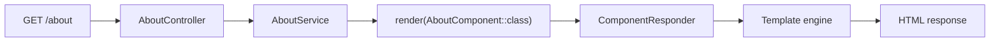

# Pages and Components

Assegai can serve JSON APIs, but it also supports server-rendered pages. Two rendering styles are visible in the framework today:

- classic view rendering with `View`
- component-backed page rendering with declarations and `AssegaiComponent`

Understanding both is useful because the starter app and the page generator demonstrate different parts of the rendering stack.

## The starter app uses a classic view

The scaffolded home page returns a `View` from `AppService`:

```php
<?php

namespace Assegaiphp\BlogApi;

use Assegai\Core\Attributes\Injectable;
use Assegai\Core\Config;
use Assegai\Core\Config\ProjectConfig;
use Assegai\Core\Rendering\View;

#[Injectable]
class AppService
{
  public function __construct(protected ProjectConfig $config)
  {
  }

  public function home(): View
  {
    $name = $this->config->get('name') ?? 'Your app';

    return view('index', [
      'title' => 'Muli Bwanji',
      'subtitle' => "Congratulations! $name is running.",
      'welcomeLink' => Config::get('contact')['links']['assegai_website'],
      'documentationLink' => Config::get('contact')['links']['documentation_link'],
    ]);
  }
}
```

That `view('index', ...)` helper looks for templates under `src/Views`, so the starter page lives at:

```text
src/Views/index.php
```

Use this path when you want a straightforward server-rendered page without introducing a dedicated component.

## Generated pages use declarations and components

When you run:

```bash
assegai g pg about
```

the generator creates:

```text
src/About/
├── AboutComponent.css
├── AboutComponent.php
├── AboutComponent.twig
├── AboutController.php
├── AboutModule.php
└── AboutService.php
```

This is a different rendering model from the starter home page.

## The generated module declares the component

```php
<?php

namespace Assegaiphp\BlogApi\About;

use Assegai\Core\Attributes\Modules\Module;

#[Module(
  declarations: [AboutComponent::class],
  providers: [AboutService::class],
  controllers: [AboutController::class],
)]
readonly class AboutModule
{
}
```

The key new idea here is `declarations`. This is how the module makes the component part of the rendering graph.

## The generated service returns a component

```php
<?php

namespace Assegaiphp\BlogApi\About;

use Assegai\Core\Attributes\Injectable;
use Assegai\Core\Components\Interfaces\ComponentInterface;

#[Injectable]
class AboutService
{
  public function getAboutPage(): ComponentInterface
  {
    return render(AboutComponent::class);
  }
}
```

The `render()` helper constructs the component for you through the component factory and DI container.

## The component itself is explicit

```php
<?php

namespace Assegaiphp\BlogApi\About;

use Assegai\Core\Attributes\Component;
use Assegai\Core\Components\AssegaiComponent;

#[Component(
  selector: 'about',
  templateUrl: './AboutComponent.twig',
  styleUrls: ['./AboutComponent.css'],
)]
class AboutComponent extends AssegaiComponent
{
  public string $name = 'about';
}
```

And the template is small and focused:

```twig
<p>{{ name }} works!</p>
```

## How page rendering flows



This is useful because it gives you a modular page system, not just a loose collection of template files.

## When to use a view vs a component

Use a classic `View` when:

- the page is small
- you already have a template in `src/Views`
- you want a very direct controller/service/template flow

Use a generated page component when:

- the page is feature-owned and deserves its own module
- you want template, styles, service, and route kept together
- you want the page to participate in the declarations system

## Why this matters

The page generator shows that Assegai's architecture is not API-only. The same module system that organizes controllers and providers also organizes rendered UI.

That means a single Assegai app can comfortably combine:

- REST endpoints
- admin pages
- marketing pages
- hybrid API + HTML workflows

without splitting into separate applications too early.
