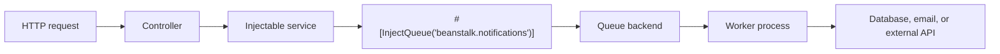

# Queues and Background Jobs

AssegaiPHP supports queue-backed background work through:

- `assegaiphp/rabbitmq`
- `assegaiphp/beanstalkd`

This matters because not all useful work belongs inside the request-response cycle.

Use a queue when a request should start work, not wait for every piece of that work to finish before the user gets a response.

Queues are a good fit when you want to:

- keep HTTP requests fast
- process notifications, emails, and exports asynchronously
- smooth out traffic spikes
- decouple slow work from user-facing endpoints

## Pick the right provider

The current official queue guide positions the supported providers like this:

- RabbitMQ for durable messaging and more complex routing patterns
- Beanstalkd for lightweight, fast job queues

If you want the most operational flexibility, start with RabbitMQ. If you want a simpler background job system, Beanstalkd is often the lighter path.

## Install the queue package you need

Install the package that matches your chosen driver:

```bash
composer require assegaiphp/rabbitmq
```

```bash
composer require assegaiphp/beanstalkd
```

## RabbitMQ setup note

`assegaiphp/rabbitmq` currently requires the PHP `amqp` extension in addition to the Composer package itself.

If you see an error like this during `composer install` or `composer require`:

```text
Root composer.json requires PHP extension ext-amqp * but it is missing from your system.
```

that does **not** usually mean RabbitMQ itself is broken. It means the copy of PHP that Composer is using does not have the `amqp` extension enabled.

Start by checking the PHP CLI environment that Composer is using:

```bash
php --ini
php -m | grep amqp
```

If `amqp` does not appear in the module list, install or enable it for the same PHP version you use on the command line.

On Debian or Ubuntu systems, that is often one of these:

```bash
sudo apt install php-amqp
```

```bash
sudo apt install php8.5-amqp
```

If your package manager does not provide it yet, `pecl` is often the fallback:

```bash
sudo pecl install amqp
```

After enabling the extension, run `php -m | grep amqp` again and then rerun Composer.

Avoid using `--ignore-platform-req=ext-amqp` for normal development. It can install the package into an environment that still cannot actually run the RabbitMQ driver.

## Configure named queue connections

Queue configuration lives in `config/queues.php`.

```php
<?php

use Assegai\Beanstalkd\BeanstalkQueue;
use Assegai\Rabbitmq\RabbitMQQueue;

return [
  'drivers' => [
    'rabbitmq' => RabbitMQQueue::class,
    'beanstalk' => BeanstalkQueue::class,
  ],
  'connections' => [
    'rabbitmq' => [
      'notes' => [
        'host' => 'localhost',
        'port' => 5672,
        'username' => 'guest',
        'password' => 'guest',
        'vhost' => '/',
        'exchange_name' => 'assegai',
        'passive' => false,
        'durable' => true,
        'exclusive' => false,
        'auto_delete' => false,
      ],
    ],
    'beanstalk' => [
      'notifications' => [
        'host' => 'localhost',
        'port' => 11300,
        'connection_timeout' => 10,
        'receive_timeout' => 10,
      ],
    ],
  ],
];
```

Those names are important because queue injection uses the `driver.connection` form:

- `rabbitmq.notes`
- `beanstalk.notifications`

## Produce jobs from an injectable service

The core package exposes `#[InjectQueue]`, which binds a named queue connection into an injectable class.

```php
<?php

namespace Assegaiphp\BlogApi\Notifications;

use Assegai\Common\Interfaces\Queues\QueueInterface;
use Assegai\Core\Attributes\Injectable;
use Assegai\Core\Queues\Attributes\InjectQueue;
use Assegaiphp\BlogApi\Notifications\DTOs\CreateNotificationDTO;

#[Injectable]
readonly class NotificationsService
{
  public function __construct(
    #[InjectQueue('beanstalk.notifications')]
    private QueueInterface $notificationsQueue,
  ) {
  }

  public function create(CreateNotificationDTO $dto): array
  {
    $this->notificationsQueue->add($dto);

    return ['message' => 'Notification enqueued'];
  }
}
```

That is a very Assegai-style pattern:

- the controller stays thin
- the service stays injectable
- the queue connection is resolved through attributes and configuration

## Use a controller to hand off work quickly

```php
<?php

namespace Assegaiphp\BlogApi\Notifications;

use Assegai\Core\Attributes\Controller;
use Assegai\Core\Attributes\Http\Body;
use Assegai\Core\Attributes\Http\Post;
use Assegaiphp\BlogApi\Notifications\DTOs\CreateNotificationDTO;

#[Controller('notifications')]
readonly class NotificationsController
{
  public function __construct(private NotificationsService $notificationsService)
  {
  }

  #[Post]
  public function create(#[Body] CreateNotificationDTO $dto): array
  {
    return $this->notificationsService->create($dto);
  }
}
```

This is where queues become practically useful. Instead of sending the notification during the request, you accept the job quickly and let a worker handle the heavier part later.

## What the worker side does

The code above shows the application side of queues: your controller accepts a request, your service pushes a job onto a named queue, and the HTTP response can return quickly.

The other half is a worker process. You can think of it as a long-running background process that listens for jobs on the queue and does the slow work there instead of inside the request.

The exact worker command depends on the queue package and the way you choose to run background processes in your environment. The main idea to keep in mind is simpler than the command syntax:

- controllers and services enqueue work
- worker processes consume jobs away from the request path
- the queue backend handles delivery between the two sides

If you are new to queues, that separation matters more than memorizing a worker command first. Once the handoff pattern makes sense, the worker process is just the piece that keeps reading from the queue and running the job logic.

## Add a queue processor

Assegai now includes queue commands in the CLI, so the normal workflow is:

1. enqueue jobs from a controller or service
2. generate or add a processor class for that queue
3. run `assegai queue:work driver.connection`

You can scaffold the processor with the CLI:

```bash
assegai g qp notifications --queue=beanstalk.notifications
```

If you already have a concrete job class, you can type the handler method while generating:

```bash
assegai g qp notifications --queue=beanstalk.notifications --job=Jobs/NotificationJob
```

If your feature already has a local `Jobs` folder, a bare job name works too:

```bash
assegai g qp notifications --queue=beanstalk.notifications --job=notification-job
```

Here is a small processor example:

```php
<?php

declare(strict_types=1);

namespace Assegaiphp\BlogApi\Notifications;

use Assegai\Core\Attributes\Injectable;
use Assegai\Core\Queues\Attributes\QueueProcessor;
use Assegaiphp\BlogApi\Notifications\DTOs\CreateNotificationDTO;

#[Injectable]
#[QueueProcessor('beanstalk.notifications')]
final class NotificationsProcessor
{
  public function process(CreateNotificationDTO $job): void
  {
    // Replace this with the real work for the job.
    // For example: send an email, call an external API, or write to the database.
  }
}
```

The important part is the attribute:

- `#[QueueProcessor('beanstalk.notifications')]` tells the CLI which queue this class works
- `process(...)` is the method the worker calls for each job
- the class should be an injectable provider so it can use constructor injection like the rest of the app

Once that processor is registered in a module provider list, you can run:

```bash
assegai queue:list
assegai queue:work beanstalk.notifications
```

If you want the worker to process one job and exit, use:

```bash
assegai queue:work beanstalk.notifications --once
```

`queue:list` helps you confirm two things:

- the queue connection exists in `config/queues.php`
- the CLI discovered the processor class for that queue

## Fallback: a plain PHP worker script

If you do not want to use the CLI worker yet, you can still run a simple PHP script yourself:

```php
<?php

declare(strict_types=1);

use Assegai\Common\Interfaces\Queues\QueueInterface;

require __DIR__ . '/../vendor/autoload.php';

$driverClass = config('queues.drivers.beanstalk');
$queueConfig = config('queues.connections.beanstalk.notifications');

if (!is_string($driverClass) || !class_exists($driverClass) || !is_array($queueConfig)) {
  throw new RuntimeException('Queue configuration for beanstalk.notifications is missing.');
}

$queueConfig['name'] ??= 'notifications';

/** @var QueueInterface $queue */
$queue = $driverClass::create($queueConfig);

while (true) {
  $result = $queue->process(function (object $job): void {
    printf("Processing %s\n", $job::class);
  });

  if ($result->getJob() === null) {
    usleep(500_000);
    continue;
  }

  if ($result->isError()) {
    foreach ($result->getErrors() as $error) {
      error_log($error->getMessage());
    }
  }
}
```

That fallback is useful if you want total control over the worker loop, but the CLI path is usually the easier place to start.

The moving parts are still the same:

- load the app dependencies
- read the queue configuration
- create the queue connection
- keep processing jobs in a loop
- handle idle time and errors

## How it fits the Assegai architecture



This is a natural extension of the same ideas you see elsewhere in the framework:

- dependency injection instead of manual wiring
- configuration-driven integration points
- thin transport layers
- feature logic living in dedicated services

## Practical advice

Use queues when:

- the work is slow enough to hurt request latency
- retries matter
- throughput spikes are normal
- the job can be handled eventually rather than immediately

Keep the first version simple:

- pick one queue provider
- name queues clearly
- enqueue DTO-like payloads
- keep worker processes focused on one job type
- let HTTP handlers return quickly
