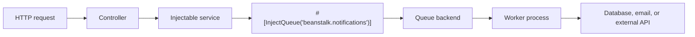

# Queues and Background Jobs

AssegaiPHP supports queue-backed background work through:

- `assegaiphp/rabbitmq`
- `assegaiphp/beanstalkd`

This matters because not all useful work belongs inside the request-response cycle.

Queues are a good fit when you want to:

- keep HTTP requests fast
- process notifications, emails, and exports asynchronously
- smooth out traffic spikes
- decouple slow work from user-facing endpoints

## Pick the right provider

The current official queue guide positions the supported providers like this:

- RabbitMQ for durable messaging and more complex routing patterns
- Beanstalkd for lightweight, fast job queues

If you want the most operational flexibility, start with RabbitMQ. If you want a simpler background job system, Beanstalkd is often the lighter path.

## Install the queue package you need

Install the package that matches your chosen driver:

```bash
composer require assegaiphp/rabbitmq
```

```bash
composer require assegaiphp/beanstalkd
```

## Configure named queue connections

Queue configuration lives in `config/queues.php`.

```php
<?php

use Assegai\Beanstalkd\BeanstalkQueue;
use Assegai\Rabbitmq\RabbitMQQueue;

return [
  'drivers' => [
    'rabbitmq' => RabbitMQQueue::class,
    'beanstalk' => BeanstalkQueue::class,
  ],
  'connections' => [
    'rabbitmq' => [
      'notes' => [
        'host' => 'localhost',
        'port' => 5672,
        'username' => 'guest',
        'password' => 'guest',
        'vhost' => '/',
        'exchange_name' => 'assegai',
        'passive' => false,
        'durable' => true,
        'exclusive' => false,
        'auto_delete' => false,
      ],
    ],
    'beanstalk' => [
      'notifications' => [
        'host' => 'localhost',
        'port' => 11300,
        'connection_timeout' => 10,
        'receive_timeout' => 10,
      ],
    ],
  ],
];
```

Those names are important because queue injection uses the `driver.connection` form:

- `rabbitmq.notes`
- `beanstalk.notifications`

## Produce jobs from an injectable service

The core package exposes `#[InjectQueue]`, which binds a named queue connection into an injectable class.

```php
<?php

namespace Assegaiphp\BlogApi\Notifications;

use Assegai\Common\Interfaces\Queues\QueueInterface;
use Assegai\Core\Attributes\Injectable;
use Assegai\Core\Queues\Attributes\InjectQueue;
use Assegaiphp\BlogApi\Notifications\DTOs\CreateNotificationDTO;

#[Injectable]
readonly class NotificationsService
{
  public function __construct(
    #[InjectQueue('beanstalk.notifications')]
    private QueueInterface $notificationsQueue,
  ) {
  }

  public function create(CreateNotificationDTO $dto): array
  {
    $this->notificationsQueue->add($dto);

    return ['message' => 'Notification enqueued'];
  }
}
```

That is a very Assegai-style pattern:

- the controller stays thin
- the service stays injectable
- the queue connection is resolved through attributes and configuration

## Use a controller to hand off work quickly

```php
<?php

namespace Assegaiphp\BlogApi\Notifications;

use Assegai\Core\Attributes\Controller;
use Assegai\Core\Attributes\Http\Body;
use Assegai\Core\Attributes\Http\Post;
use Assegaiphp\BlogApi\Notifications\DTOs\CreateNotificationDTO;

#[Controller('notifications')]
readonly class NotificationsController
{
  public function __construct(private NotificationsService $notificationsService)
  {
  }

  #[Post]
  public function create(#[Body] CreateNotificationDTO $dto): array
  {
    return $this->notificationsService->create($dto);
  }
}
```

This is where queues become practically useful. Instead of sending the notification during the request, you accept the job quickly and let a worker handle the heavier part later.

## Worker side responsibilities

The producer side shown above is verified directly in the current PHP packages: queues are configured by name and injected with `#[InjectQueue(...)]`.

The worker side is intentionally documented here at the architectural level rather than tied to one unverified consumer API shape.

The important idea is the separation of concerns:

- controllers and services enqueue work
- worker processes consume and process it off the main request path
- queue infrastructure handles delivery and retries

## How it fits the Assegai architecture



This is a natural extension of the same ideas you see elsewhere in the framework:

- dependency injection instead of manual wiring
- configuration-driven integration points
- thin transport layers
- feature logic living in dedicated services

## Practical advice

Use queues when:

- the work is slow enough to hurt request latency
- retries matter
- throughput spikes are normal
- the job can be handled eventually rather than immediately

Keep the first version simple:

- pick one queue provider
- name queues clearly
- enqueue DTO-like payloads
- keep worker processes focused on one job type
- let HTTP handlers return quickly
