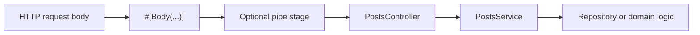

# Request Data and Validation

Assegai's request pipeline is easiest to use when you lean on DTOs, parameter decorators, and pipes instead of hand-parsing everything inside controllers.

## Generated DTOs are the starting point

A generated resource gives you input classes like:

```php
<?php

namespace Assegaiphp\BlogApi\Posts\DTOs;

use Assegai\Core\Attributes\Injectable;

#[Injectable]
class CreatePostDTO
{
}
```

That is intentionally minimal. The next step is to make the DTO describe the request you actually want to accept.

## Add validation attributes to the DTO

Because Assegai ships with the validation package in the wider ecosystem, a natural next step is:

```php
<?php

namespace Assegaiphp\BlogApi\Posts\DTOs;

use Assegai\Core\Attributes\Injectable;
use Assegai\Validation\Attributes\IsNotEmpty;
use Assegai\Validation\Attributes\IsString;

#[Injectable]
class CreatePostDTO
{
  #[IsString]
  #[IsNotEmpty]
  public string $title = '';

  #[IsString]
  #[IsNotEmpty]
  public string $body = '';
}
```

The same idea works for update DTOs, often with looser requirements depending on the use case.

## Validation and pipes

The core package includes a pipe surface for request transformation and validation.

Built-in pipes currently include:

- `ValidationPipe`
- `ParseIntPipe`
- `ParseBoolPipe`
- `ParseFloatPipe`
- `ParseArrayPipe`
- `ParseFilePipe`
- `MapProperties`

At the application level, `App` also exposes `useGlobalPipes(...)`. In the current codebase, the clearest verified request-time pipe flow is through decorator-bound parameter handling, especially on `#[Body(...)]`.

## App-level pipe registration

Assegai exposes an app-level `useGlobalPipes(...)` API in `bootstrap.php`:

```php
<?php

use Assegai\Core\AssegaiFactory;
use Assegai\Core\Pipes\ValidationPipe;
use Assegaiphp\BlogApi\AppModule;

require './vendor/autoload.php';

function bootstrap(): void
{
  $app = AssegaiFactory::create(AppModule::class);
  $app->useGlobalPipes(new ValidationPipe());
  $app->run();
}

bootstrap();
```

If your target app version uses that app-level pipe path, this keeps validation close to the HTTP boundary instead of scattering it through every service method.

For the current core codebase, the clearest request-time pipe path I verified directly is still decorator-bound parameter handling such as `#[Body(pipes: ...)]`.

## Apply a pipe to a bound request body

Because `#[Body]` accepts a `pipes` argument, you can transform payloads before they are cast into your DTO.

Start with a generated pipe:

```bash
assegai generate pipe trim-strings
```

Then implement it:

```php
<?php

namespace Assegaiphp\BlogApi\TrimStrings;

use Assegai\Core\Attributes\Injectable;
use Assegai\Core\Interfaces\IPipeTransform;
use stdClass;

#[Injectable]
class TrimStringsPipe implements IPipeTransform
{
  public function transform(mixed $value, array|stdClass|null $metaData = null): mixed
  {
    if (is_object($value)) {
      foreach (get_object_vars($value) as $key => $item) {
        if (is_string($item)) {
          $value->$key = trim($item);
        }
      }
    }

    return $value;
  }
}
```

And use it in the controller:

```php
<?php

use Assegai\Core\Attributes\Http\Body;
use Assegai\Core\Attributes\Http\Post;
use Assegaiphp\BlogApi\Posts\DTOs\CreatePostDTO;
use Assegaiphp\BlogApi\TrimStrings\TrimStringsPipe;

#[Post]
public function create(
  #[Body(pipes: TrimStringsPipe::class)] CreatePostDTO $dto,
): mixed {
  return $this->postsService->create($dto);
}
```

This is a good fit for:

- trimming incoming strings
- renaming or mapping properties
- coercing loose payloads before the service sees them

## Bind request bodies directly into DTOs

Once the DTO exists, the controller stays compact:

```php
<?php

namespace Assegaiphp\BlogApi\Posts;

use Assegai\Core\Attributes\Controller;
use Assegai\Core\Attributes\Http\Body;
use Assegai\Core\Attributes\Http\Post;
use Assegaiphp\BlogApi\Posts\DTOs\CreatePostDTO;

#[Controller('posts')]
readonly class PostsController
{
  public function __construct(private PostsService $postsService)
  {
  }

  #[Post]
  public function create(#[Body] CreatePostDTO $dto): mixed
  {
    return $this->postsService->create($dto);
  }
}
```

That is one of the key developer-experience wins of the framework: request data enters the controller already shaped like the thing your service expects.

## Query strings and request metadata

Use `RequestQuery` when you want the whole query object:

```php
<?php

use Assegai\Core\Attributes\Http\Query;
use Assegai\Core\Http\Requests\RequestQuery;

#[Get]
public function search(#[Query] RequestQuery $query): array
{
  return [
    'search' => $query->get('search'),
    'limit' => $query->get('limit', '10'),
    'page' => $query->get('page', '1'),
  ];
}
```

Use `Request` when you want request-level details:

```php
<?php

use Assegai\Core\Attributes\Req;
use Assegai\Core\Http\Requests\Request;

#[Get('meta')]
public function meta(#[Req] Request $request): array
{
  return [
    'method' => $request->getMethod()->value,
    'path' => $request->getPath(),
    'limit' => $request->getLimit(),
    'skip' => $request->getSkip(),
  ];
}
```

## Route params should stay typed

Use both route constraints and typed parameters:

```php
#[Get(':id<int>')]
public function findById(#[Param('id')] int $id): mixed
{
  return $this->postsService->findById($id);
}
```

That keeps the contract obvious at a glance:

- the route says what matches
- the method signature says what the handler expects

## A practical DTO flow



This is one of the reasons Assegai's Nest-like structure works well: transport concerns stay near the controller boundary, while the service still receives a useful object instead of a bag of globals.

## Good defaults

If you want a dependable request-handling style:

- use DTOs for request bodies
- mark DTOs as `#[Injectable]`
- add validation attributes to DTO properties
- use pipe-based validation and transformation at the boundary
- use pipes to normalize request bodies at the boundary
- use constrained route params for identifiers
- inject `RequestQuery` instead of manually parsing `$_GET`

That gives you a clean upgrade path from generated code to production-shaped code without changing the overall architecture halfway through the project.
